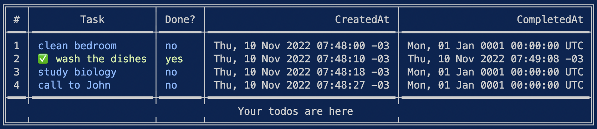

# To Do CLI

This is a simple todo CLI, this code is based in [Abah Joseph video](https://www.youtube.com/watch?v=j1CXoOQXbco).



### Requisites
- Golang

### Running
First you need to build the project
```
make build
```
After build, you have the project binaries and you can run the todo app with the commands bellow:
### Add a task
```
./todo -add <your_task>
./todo -add clean my bedroom
```

### List all tasks
```
./todo -list
```

### Complete a task
```
./todo -complete=<index>
./todo -complete=1
```

### Delete a task
```
./todo -del=<index>
./todo -del=1
```